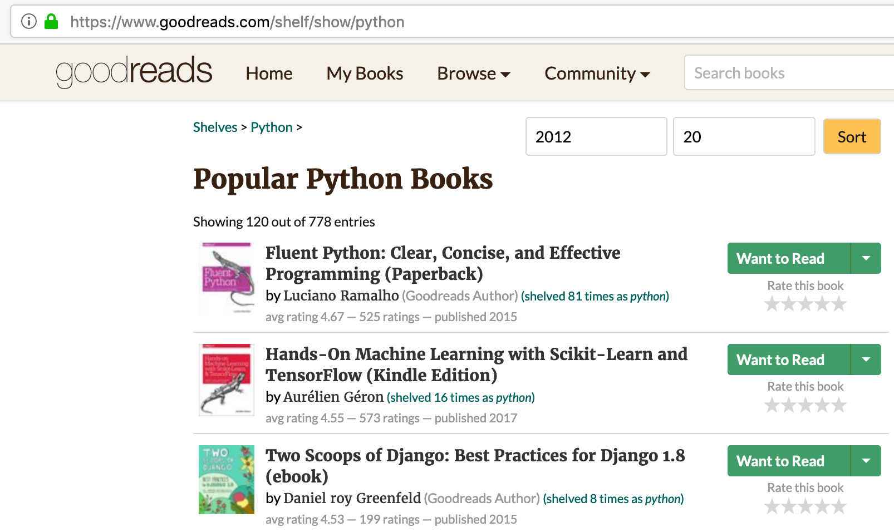
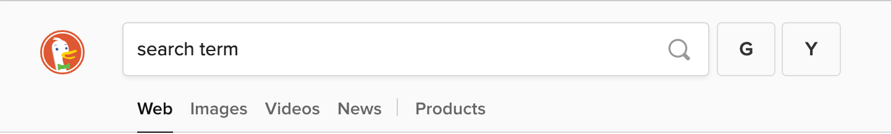

# tampermonkeyScripts
Extension homepage: https://tampermonkey.net/

- Goodreads shelf search: adds filter/sort interface to shelf pages `https://www.goodreads.com/shelf/show/*`. Sorts books by rating, filters by the number of ratings and publish date (some books do not have published date specified, they'll be filtered out if non-zero published date is specified). Loads entire pages to process, so it's not resource efficient. Goodreads had a cap of 1250 entries in the shelf per tag, recently changed to, seemingly, any number, so the hard limit of 50 first pages to request is added.

  

- DuckDuckGo alternative search engines: adds Google and Yandex to one-click search there.

  

